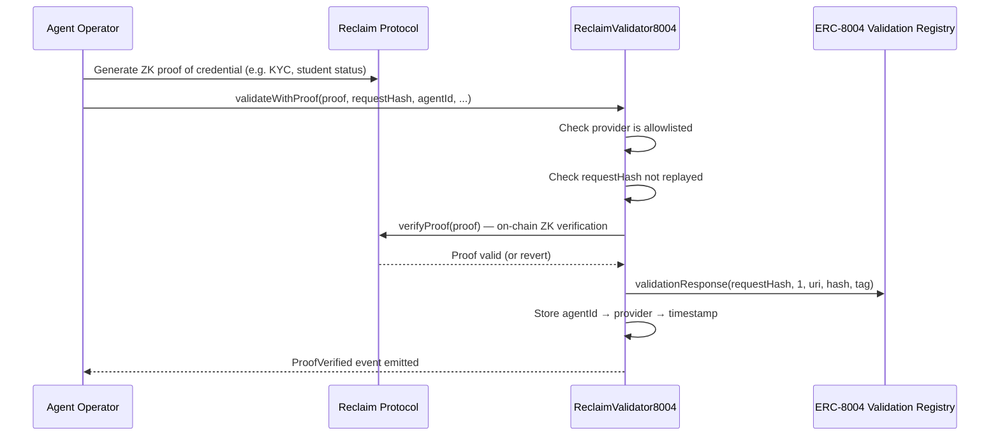

# Reclaim 8004 Validator

ZK credential validator for [ERC-8004](https://ethereum-magicians.org/t/erc-8004-agent-registry/22106) — verifies **who operates an AI agent** using Reclaim Protocol ZK proofs, and posts the result to the ERC-8004 Validation Registry on-chain.

## The Problem

ERC-8004 defines an Agent Registry with a Validation Registry that lets third parties validate claims about AI agents. TEE-based validators can verify that an agent's *code executes correctly*, but they can't verify **who operates the service** — the human or organization behind it.

Identity claims like "I'm a verified Coinbase user" or "I'm a university student" require proof that originates from external platforms. Without a way to bring these credentials on-chain, anyone can claim to be anyone in the agent registry.

## How It Works



1. An agent operator obtains a **Reclaim ZK proof** for a credential (Coinbase KYC, university enrollment, X/Twitter account ownership, etc.)
2. They call `validateWithProof()` on this contract with the proof and the ERC-8004 request hash
3. The contract **verifies the ZK proof on-chain** by calling the deployed Reclaim verifier
4. On success, it posts a `validationResponse()` to the ERC-8004 Validation Registry with `response = 1` (approved)
5. The validation is now permanently recorded on-chain, linking the agent to a verified credential

## Architecture

```
┌─────────────────────────────────────────────────────────┐
│                    Agent Operator                        │
│  (holds Reclaim ZK proof of identity credential)        │
└──────────────────────┬──────────────────────────────────┘
                       │ validateWithProof()
                       ▼
┌─────────────────────────────────────────────────────────┐
│              ReclaimValidator8004                        │
│                                                         │
│  ┌─────────────┐  ┌──────────────┐  ┌───────────────┐  │
│  │  Provider    │  │   Replay     │  │   Agent       │  │
│  │  Allowlist   │  │  Prevention  │  │  Tracking     │  │
│  │             │  │  (requestHash│  │  (agentId →   │  │
│  │  addProvider │  │   → bool)    │  │   provider →  │  │
│  │  removeProv. │  │              │  │   timestamp)  │  │
│  └─────────────┘  └──────────────┘  └───────────────┘  │
│                                                         │
│  On valid proof:                                        │
│  ├── Calls Reclaim.verifyProof() ──────────────────┐    │
│  └── Calls Registry.validationResponse() ──────┐   │    │
└─────────────────────────────────────────────────┼───┼───┘
                                                  │   │
                 ┌────────────────────────────────┘   │
                 ▼                                    ▼
┌──────────────────────────┐   ┌──────────────────────────┐
│  ERC-8004 Validation     │   │  Reclaim Protocol        │
│  Registry                │   │  Verifier Contract       │
│                          │   │                          │
│  0x8004C11C213ff7BaD...  │   │  (chain-specific addr)   │
└──────────────────────────┘   └──────────────────────────┘
```

## Deployed Addresses

| Chain | Contract | Address |
|-------|----------|---------|
| Polygon Amoy | ReclaimValidator8004 | `0x1ea39e2b511cd8162EE5cC0A874d0a3E8643C529` |
| Polygon Amoy | Reclaim Verifier | `0xcd94A4f7F85dFF1523269C52D0Ab6b85e9B22866` |
| Polygon Amoy | Validation Registry | `0x8004C11C213ff7BaD36489bcBDF947ba5eee289B` |
| Polygon Amoy | Identity Registry | `0x8004ad19E14B9e0654f73353e8a0B600D46C2898` |

### Whitelisted Providers (Amoy)

- `http-provider-student-verification`
- `http-provider-coinbase-kyc`
- `http-provider-x-account`

## Getting Started

### Prerequisites

- [Foundry](https://book.getfoundry.sh/getting-started/installation)
- Node.js (for dependency installation)

### Build

```bash
git clone https://github.com/reclaimprotocol/reclaim-8004-validator.git
cd reclaim-8004-validator
npm install
forge build
```

### Test

```bash
forge test
```

## Deploying to Other Chains

1. **Find the Reclaim verifier address** for your target chain in [`Addresses.sol`](https://github.com/reclaimprotocol/verifier-solidity-sdk) or see the [supported networks](https://docs.reclaimprotocol.org/onchain/solidity/supported-networks).

2. **Create a deploy script** (or modify an existing one) with the correct addresses:

```solidity
address constant RECLAIM_VERIFIER = 0x...; // chain-specific Reclaim verifier
address constant VALIDATION_REGISTRY = 0x8004C11C213ff7BaD36489bcBDF947ba5eee289B;
address constant IDENTITY_REGISTRY = 0x8004ad19E14B9e0654f73353e8a0B600D46C2898;
```

3. **Deploy:**

```bash
export PRIVATE_KEY=0x...
forge script script/Deploy.s.sol:DeployReclaimValidator8004 \
  --rpc-url <YOUR_RPC_URL> \
  --broadcast --legacy
```

4. **Whitelist providers** after deployment:

```bash
cast send <DEPLOYED_ADDRESS> "addProvider(string)" "http-provider-coinbase-kyc" \
  --private-key $PRIVATE_KEY --rpc-url <YOUR_RPC_URL> --legacy
```

### Reclaim Verifier Addresses by Chain

| Chain | Reclaim Verifier |
|-------|-----------------|
| Polygon Mainnet | `0xd6534f52CEB3d0139b915bc0C3278a94687fA5C7` |
| Polygon Amoy | `0xcd94A4f7F85dFF1523269C52D0Ab6b85e9B22866` |
| Base | `0x8CDc031d5B7F148ab0435028B16c682c469CEfC3` |
| Base Sepolia | `0xF90085f5Fd1a3bEb8678623409b3811eCeC5f6A5` |
| Ethereum | `0xA2bFF333d2E5468cF4dc6194EB4B5DdeFA2625C0` |
| Ethereum Sepolia | `0xAe94FB09711e1c6B057853a515483792d8e474d0` |
| Arbitrum | `0x9F0472FD02Ca1BC2d6C3A1702803Ba822C7C7E91` |
| Optimism | `0xB238380c4C6C1a7eD9E1808B1b6fcb3F1B2836cF` |

See `src/reclaim/Addresses.sol` or the [Reclaim docs](https://docs.reclaimprotocol.org/onchain/solidity/supported-networks) for the full list.

## Contract Interface

### Core Function

```solidity
function validateWithProof(
    Reclaim.Proof calldata proof,   // Reclaim ZK proof
    bytes32 requestHash,            // ERC-8004 request hash
    bytes32 agentId,                // Agent identifier
    string calldata responseUri,    // Off-chain metadata URI
    bytes32 tag                     // Arbitrary tag
) external
```

### Admin Functions

```solidity
function addProvider(string calldata provider) external onlyOwner
function removeProvider(string calldata provider) external onlyOwner
function transferOwnership(address newOwner) external onlyOwner
```

### View Functions

```solidity
function isProviderAllowed(string calldata provider) external view returns (bool)
function isRequestProcessed(bytes32 requestHash) external view returns (bool)
function getAgentProviderTimestamp(bytes32 agentId, string calldata provider) external view returns (uint256)
```

## License

MIT
