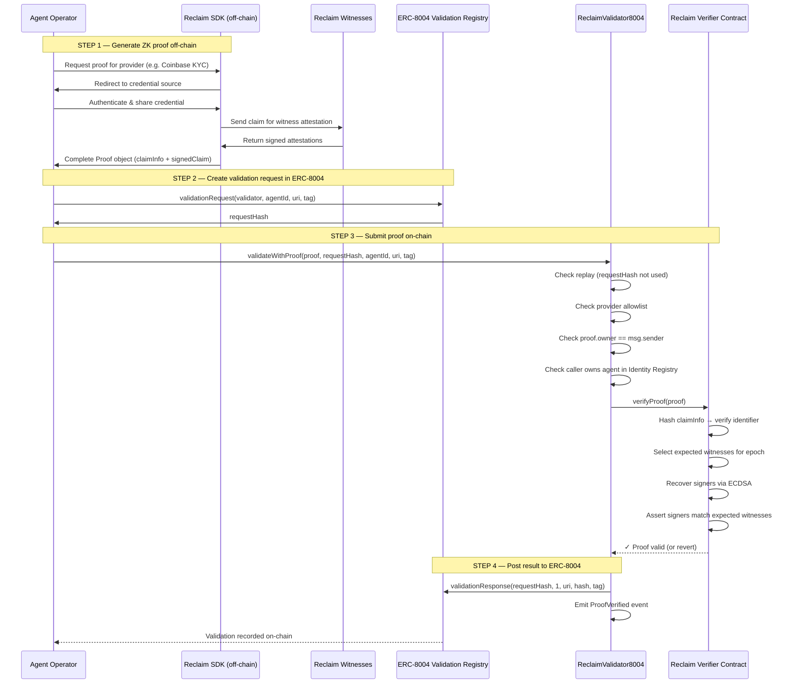

# ReclaimValidator8004

ZK credential validator for [ERC-8004 Agent Registry](https://ethereum-magicians.org/t/erc-8004-agent-registry/22106) — verifies **who operates an AI agent** using [Reclaim Protocol](https://reclaimprotocol.org/) ZK proofs and posts the result to the ERC-8004 Validation Registry on-chain.

## Table of Contents

- [The Problem](#the-problem)
- [End-to-End Flow](#end-to-end-flow)
  - [Step 1: Generate a Reclaim ZK Proof Off-Chain](#step-1-generate-a-reclaim-zk-proof-off-chain)
  - [Step 2: Create a Validation Request in ERC-8004](#step-2-create-a-validation-request-in-erc-8004)
  - [Step 3: Submit the Proof On-Chain](#step-3-submit-the-proof-on-chain)
  - [Step 4: On-Chain Verification & Registry Update](#step-4-on-chain-verification--registry-update)
- [Contract Architecture](#contract-architecture)
  - [State Layout](#state-layout)
  - [Proof Verification Internals](#proof-verification-internals)
  - [Public Inputs & Data Structures](#public-inputs--data-structures)
- [Security Model](#security-model)
- [Contract Interface](#contract-interface)
- [Deployed Addresses](#deployed-addresses)
- [Getting Started](#getting-started)
- [Testing](#testing)
- [Deploying to Other Chains](#deploying-to-other-chains)
- [License](#license)

---

## The Problem

ERC-8004 defines an Agent Registry with a Validation Registry that lets third parties validate claims about AI agents. TEE-based validators can verify that an agent's *code executes correctly*, but they can't verify **who operates the service** — the human or organization behind it.

Identity claims like "I'm a verified Coinbase user" or "I'm a university student" require proof that originates from external platforms. Without a way to bring these credentials on-chain, anyone can claim to be anyone in the agent registry.

**ReclaimValidator8004** solves this by accepting Reclaim Protocol ZK proofs of off-chain credentials and converting them into ERC-8004 validation responses.

---

## End-to-End Flow


```mermaid
sequenceDiagram
    participant Operator as Agent Operator
    participant SDK as Reclaim SDK (off-chain)
    participant Witnesses as Reclaim Witnesses
    participant Registry as ERC-8004 Validation Registry
    participant Validator as ReclaimValidator8004
    participant Verifier as Reclaim Verifier Contract

    Note over Operator,SDK: STEP 1 — Generate ZK proof off-chain
    Operator->>SDK: Request proof for provider (e.g. Coinbase KYC)
    SDK->>Operator: Redirect to credential source
    Operator->>SDK: Authenticate & share credential
    SDK->>Witnesses: Send claim for witness attestation
    Witnesses->>SDK: Return signed attestations
    SDK->>Operator: Complete Proof object (claimInfo + signedClaim)

    Note over Operator,Registry: STEP 2 — Create validation request in ERC-8004
    Operator->>Registry: validationRequest(validator, agentId, uri, tag)
    Registry->>Operator: requestHash

    Note over Operator,Verifier: STEP 3 — Submit proof on-chain
    Operator->>Validator: validateWithProof(proof, requestHash, agentId, uri, tag)
    Validator->>Validator: Check replay (requestHash not used)
    Validator->>Validator: Check provider allowlist
    Validator->>Validator: Check proof.owner == msg.sender
    Validator->>Validator: Check caller owns agent in Identity Registry
    Validator->>Verifier: verifyProof(proof)
    Verifier->>Verifier: Hash claimInfo → verify identifier
    Verifier->>Verifier: Select expected witnesses for epoch
    Verifier->>Verifier: Recover signers via ECDSA
    Verifier->>Verifier: Assert signers match expected witnesses
    Verifier-->>Validator: ✓ Proof valid (or revert)

    Note over Validator,Registry: STEP 4 — Post result to ERC-8004
    Validator->>Registry: validationResponse(requestHash, 1, uri, hash, tag)
    Validator->>Validator: Emit ProofVerified event
    Registry-->>Operator: Validation recorded on-chain
```

### Step 1: Generate a Reclaim ZK Proof Off-Chain

The agent operator uses the [Reclaim Protocol SDK](https://docs.reclaimprotocol.org/) to generate a cryptographic proof of an off-chain credential. This happens entirely off-chain.

**What the operator does:**

1. Initialize the Reclaim SDK with an application ID and a **provider ID** that identifies the credential source (e.g. `http-provider-coinbase-kyc`, `http-provider-x-account`).
2. The SDK generates a request URL. The operator opens it, authenticates with the credential source (Coinbase, X/Twitter, university portal, etc.).
3. Reclaim's witness nodes attest to the credential. The SDK returns a **Proof** object.

**Example using the Reclaim JS SDK:**

```typescript
import { ReclaimProofRequest } from "@reclaimprotocol/js-sdk";

const request = await ReclaimProofRequest.init(
  APP_ID,
  APP_SECRET,
  PROVIDER_ID  // e.g. "http-provider-coinbase-kyc"
);

// Set the proof owner to the operator's Ethereum address
// IMPORTANT: This must match the address that calls validateWithProof()
request.addContext(
  `{"agentId":"29"}`,
  operatorEthAddress  // Will become proof.signedClaim.claim.owner
);

const url = await request.getRequestUrl();
// Operator opens `url` in browser, authenticates with provider

// SDK callback returns the proof object
request.startSession({
  onSuccess: (proof) => {
    // `proof` is the Reclaim.Proof struct to submit on-chain
    console.log(proof);
  },
  onError: (err) => console.error(err),
});
```

**The resulting Proof object contains:**

| Field | Description |
|-------|-------------|
| `claimInfo.provider` | Provider identifier string (e.g. `"http-provider-coinbase-kyc"`) |
| `claimInfo.parameters` | JSON string with provider-specific parameters (URL, method, response match) |
| `claimInfo.context` | JSON string with metadata (e.g. `{"agentId":"29"}`) |
| `signedClaim.claim.identifier` | `keccak256(provider + "\n" + parameters + "\n" + context)` |
| `signedClaim.claim.owner` | Ethereum address that requested the proof (must be `msg.sender`) |
| `signedClaim.claim.timestampS` | Unix timestamp when the proof was created |
| `signedClaim.claim.epoch` | Reclaim epoch ID (determines which witnesses are valid) |
| `signedClaim.signatures` | Array of ECDSA signatures from Reclaim witness nodes |

### Step 2: Create a Validation Request in ERC-8004

Before submitting a proof, a validation request must exist in the ERC-8004 Validation Registry. This is typically done by the agent operator (who must own the agent in the Identity Registry).

```solidity
// Call the ERC-8004 Validation Registry
IValidationRegistry(0x8004C11C213ff7BaD36489bcBDF947ba5eee289B).validationRequest(
    address(validator),   // Address of ReclaimValidator8004
    agentTokenId,         // uint256 — the agent's NFT token ID
    "ipfs://Qm...",       // URI with request metadata
    tag                   // bytes32 — arbitrary tag for categorization
);
```

This returns a `requestHash` (retrievable from the agent's validations list) that links the request to the response.

### Step 3: Submit the Proof On-Chain

The operator calls `validateWithProof()` on the ReclaimValidator8004 contract, passing the Reclaim proof and the ERC-8004 request context.

```solidity
validator.validateWithProof(
    proof,                  // Reclaim.Proof — the full proof from Step 1
    requestHash,            // bytes32 — from Step 2
    bytes32(uint256(29)),   // agentId — must match agent token ID
    "ipfs://QmResponse",   // responseUri — off-chain evidence/metadata
    tag                     // bytes32 — must match the request tag
);
```

**Requirements for the caller (`msg.sender`):**

1. Must be `proof.signedClaim.claim.owner` — the proof must have been generated for this address
2. Must be the owner of the agent (i.e. `identityRegistry.ownerOf(agentId) == msg.sender`)

### Step 4: On-Chain Verification & Registry Update

Inside `validateWithProof()`, the contract performs the following checks in order:

| # | Check | Reverts with |
|---|-------|-------------|
| 1 | `requestHash` not already processed | `"Request already processed"` |
| 2 | `proof.claimInfo.provider` is in the allowlist | `"Provider not allowed"` |
| 3 | `proof.signedClaim.claim.owner == msg.sender` | `"Proof owner != msg.sender"` |
| 4 | `identityRegistry.ownerOf(agentId) == msg.sender` | `"Caller is not agent owner"` |
| 5 | `reclaimVerifier.verifyProof(proof)` passes | Reverts from Reclaim verifier |

If all checks pass:

1. `agentProviderTimestamp[agentId][providerHash]` is set to `block.timestamp`
2. A `responseHash` is computed: `keccak256(provider, parameters, identifier, timestampS)`
3. `validationRegistry.validationResponse(requestHash, 1, responseUri, responseHash, tag)` is called — `response = 1` means **approved**
4. `ProofVerified(requestHash, agentId, provider, 1)` event is emitted

---

## Contract Architecture

```
┌──────────────────────────────────────────────────────────────────────┐
│                         Agent Operator                                │
│  (holds Reclaim ZK proof + owns agent in Identity Registry)          │
└──────────────────────────┬───────────────────────────────────────────┘
                           │ validateWithProof()
                           ▼
┌──────────────────────────────────────────────────────────────────────┐
│                     ReclaimValidator8004                               │
│                                                                       │
│  ┌────────────────┐  ┌─────────────────┐  ┌───────────────────────┐  │
│  │  Provider       │  │  Replay          │  │  Agent Tracking       │  │
│  │  Allowlist      │  │  Prevention      │  │                       │  │
│  │                 │  │                  │  │  agentId              │  │
│  │  bytes32 => bool│  │  bytes32 => bool │  │    => providerHash   │  │
│  │                 │  │  (requestHash)   │  │       => timestamp   │  │
│  │  addProvider()  │  │                  │  │                       │  │
│  │  removeProvider │  │                  │  │                       │  │
│  └────────────────┘  └─────────────────┘  └───────────────────────┘  │
│                                                                       │
│  On valid proof:                                                      │
│  ├─ Calls Reclaim.verifyProof() ─────────────────────────────┐       │
│  ├─ Calls Registry.validationResponse() ─────────────┐       │       │
│  └─ Calls IdentityRegistry.ownerOf() ──────┐         │       │       │
└─────────────────────────────────────────────┼─────────┼───────┼──────┘
                                              │         │       │
                    ┌─────────────────────────┘         │       │
                    ▼                                   ▼       ▼
┌─────────────────────────────┐  ┌─────────────────────────────────────┐
│  ERC-8004 Identity Registry │  │  Reclaim Verifier (Reclaim.sol)     │
│  0x8004ad19E14B9e0654f...   │  │                                     │
│                             │  │  Epochs → Witnesses → Signatures    │
│  ownerOf(agentId) → address │  │  verifyProof():                     │
└─────────────────────────────┘  │    1. Hash claimInfo → identifier   │
                                 │    2. Fetch witnesses for epoch     │
┌─────────────────────────────┐  │    3. ECDSA recover signers        │
│  ERC-8004 Validation        │  │    4. Assert signers = witnesses   │
│  Registry                   │  └─────────────────────────────────────┘
│  0x8004C11C213ff7BaD...     │
│                             │
│  validationResponse(        │
│    requestHash, response,   │
│    uri, hash, tag           │
│  )                          │
└─────────────────────────────┘
```

### State Layout

```solidity
address public owner;                    // Contract admin
Reclaim public reclaimVerifier;          // On-chain ZK proof verifier
IValidationRegistry public validationRegistry;  // ERC-8004 Validation Registry
IIdentityRegistry public identityRegistry;      // ERC-8004 Identity Registry

// Provider allowlist: keccak256(providerString) => bool
mapping(bytes32 => bool) public allowedProviders;

// Replay prevention: requestHash => true once used
mapping(bytes32 => bool) public processedRequests;

// Audit trail: agentId => providerHash => block.timestamp of last validation
mapping(bytes32 => mapping(bytes32 => uint256)) public agentProviderTimestamp;
```

### Proof Verification Internals

The Reclaim verifier (`Reclaim.sol`) performs the following when `verifyProof()` is called:

1. **Identifier check** — Recompute `keccak256(provider + "\n" + parameters + "\n" + context)` and assert it matches `signedClaim.claim.identifier`. This ensures the claimInfo hasn't been tampered with.

2. **Witness selection** — Using the claim's `epoch`, `identifier`, and `timestampS`, deterministically select which witnesses should have signed the claim. The selection uses a hash-based random seed to pick `minimumWitnessesForClaimCreation` witnesses from the epoch's witness set.

3. **Signature recovery** — For each signature in `signedClaim.signatures`, serialize the claim data as:
   ```
   hex(identifier) + "\n" + hex(owner) + "\n" + timestampS + "\n" + epoch
   ```
   Then compute `keccak256("\x19Ethereum Signed Message:\n" + len + serialized)` and recover the signer via ECDSA.

4. **Witness matching** — Assert that every recovered signer address matches one of the expected witnesses from step 2.

### Public Inputs & Data Structures

#### `Reclaim.Proof` (the top-level proof submitted on-chain)

```solidity
struct Proof {
    Claims.ClaimInfo claimInfo;       // Plaintext claim metadata
    Claims.SignedClaim signedClaim;   // Signed claim data + witness signatures
}
```

#### `Claims.ClaimInfo` (public inputs — readable on-chain)

```solidity
struct ClaimInfo {
    string provider;     // Provider ID — e.g. "http-provider-coinbase-kyc"
    string parameters;   // JSON params — URL, method, response matching rules
    string context;      // JSON context — e.g. '{"agentId":"29"}'
}
```

| Field | Example | Purpose |
|-------|---------|---------|
| `provider` | `"http-provider-coinbase-kyc"` | Identifies the credential source. Must be in the contract's allowlist. |
| `parameters` | `'{"url":"https://api.coinbase.com/v2/user","method":"GET","responseMatches":[...]}'` | Provider-specific config. Defines what data is fetched and what response pattern is matched. |
| `context` | `'{"agentId":"29","extractedParameters":{"kycStatus":"verified"}}'` | Metadata. Can include extracted credential values. |

#### `Claims.CompleteClaimData` (the signed claim)

```solidity
struct CompleteClaimData {
    bytes32 identifier;   // keccak256(provider + "\n" + parameters + "\n" + context)
    address owner;        // Address that requested the proof (must == msg.sender)
    uint32 timestampS;    // Unix timestamp of proof creation
    uint32 epoch;         // Reclaim epoch (determines valid witness set)
}
```

#### `Claims.SignedClaim` (claim + witness signatures)

```solidity
struct SignedClaim {
    CompleteClaimData claim;
    bytes[] signatures;      // ECDSA signatures from Reclaim witnesses
}
```

#### `responseHash` (computed by the validator)

The validator computes a response hash posted to the ERC-8004 registry:

```solidity
bytes32 responseHash = keccak256(abi.encodePacked(
    proof.claimInfo.provider,        // e.g. "http-provider-coinbase-kyc"
    proof.claimInfo.parameters,      // provider parameters JSON
    proof.signedClaim.claim.identifier,  // bytes32 hash of claimInfo
    proof.signedClaim.claim.timestampS   // uint32 proof timestamp
));
```

This allows anyone to verify what credential was proven by inspecting the on-chain response.

---

## Security Model

| Protection | Implementation |
|-----------|----------------|
| **Replay prevention** | `processedRequests[requestHash]` — each ERC-8004 request can only be answered once |
| **Proof ownership** | `proof.signedClaim.claim.owner == msg.sender` — proofs are non-transferable |
| **Agent ownership** | `identityRegistry.ownerOf(agentId) == msg.sender` — only the agent's owner can validate it |
| **Provider allowlist** | `allowedProviders[hash]` — only admin-approved credential sources are accepted |
| **Cryptographic verification** | Reclaim witnesses sign claims; signatures are verified on-chain via ECDSA recovery |
| **Epoch-bound witnesses** | Witness sets rotate per epoch; proofs are only valid for the epoch in which they were created |

---

## Contract Interface

### Core Function

```solidity
function validateWithProof(
    Reclaim.Proof calldata proof,   // Reclaim ZK proof (claimInfo + signedClaim)
    bytes32 requestHash,            // ERC-8004 request hash to respond to
    bytes32 agentId,                // Agent identifier (bytes32 cast of token ID)
    string calldata responseUri,    // URI pointing to off-chain evidence
    bytes32 tag                     // Arbitrary tag for the response
) external
```

### Admin Functions

```solidity
function addProvider(string calldata provider) external onlyOwner
function removeProvider(string calldata provider) external onlyOwner
function transferOwnership(address newOwner) external onlyOwner
```

### View Functions

```solidity
function isProviderAllowed(string calldata provider) external view returns (bool)
function isRequestProcessed(bytes32 requestHash) external view returns (bool)
function getAgentProviderTimestamp(bytes32 agentId, string calldata provider) external view returns (uint256)
```

### Events

```solidity
event ProofVerified(bytes32 indexed requestHash, bytes32 indexed agentId, string provider, uint8 response)
event ProviderAllowed(string provider, bytes32 providerHash)
event ProviderRemoved(string provider, bytes32 providerHash)
event OwnershipTransferred(address indexed previousOwner, address indexed newOwner)
```

---

## Deployed Addresses

### Polygon Amoy (Chain 80002)

| Contract | Address |
|----------|---------|
| **ReclaimValidator8004** | [`0xe2056FA0661c7fCDE13E905D4240d27824ED249d`](https://amoy.polygonscan.com/address/0xe2056FA0661c7fCDE13E905D4240d27824ED249d) |
| Reclaim Verifier | [`0xcd94A4f7F85dFF1523269C52D0Ab6b85e9B22866`](https://amoy.polygonscan.com/address/0xcd94A4f7F85dFF1523269C52D0Ab6b85e9B22866) |
| Validation Registry | [`0x8004C11C213ff7BaD36489bcBDF947ba5eee289B`](https://amoy.polygonscan.com/address/0x8004C11C213ff7BaD36489bcBDF947ba5eee289B) |
| Identity Registry | [`0x8004ad19E14B9e0654f73353e8a0B600D46C2898`](https://amoy.polygonscan.com/address/0x8004ad19E14B9e0654f73353e8a0B600D46C2898) |

### Base Sepolia (Chain 84532)

| Contract | Address |
|----------|---------|
| **ReclaimValidator8004** | [`0x583fcFd84Fbe1bcB383E8A346bd48bF8f13565e4`](https://sepolia.basescan.org/address/0x583fcFd84Fbe1bcB383E8A346bd48bF8f13565e4) |
| Reclaim Verifier | [`0xF90085f5Fd1a3bEb8678623409b3811eCeC5f6A5`](https://sepolia.basescan.org/address/0xF90085f5Fd1a3bEb8678623409b3811eCeC5f6A5) |
| Validation Registry | [`0x8004C11C213ff7BaD36489bcBDF947ba5eee289B`](https://sepolia.basescan.org/address/0x8004C11C213ff7BaD36489bcBDF947ba5eee289B) |
| Identity Registry | [`0x8004ad19E14B9e0654f73353e8a0B600D46C2898`](https://sepolia.basescan.org/address/0x8004ad19E14B9e0654f73353e8a0B600D46C2898) |

### Whitelisted Providers

- `http-provider-student-verification`
- `http-provider-coinbase-kyc`
- `http-provider-x-account`

---

## Getting Started

### Prerequisites

- [Foundry](https://book.getfoundry.sh/getting-started/installation)
- Node.js (for dependency installation)

### Build

```bash
git clone https://github.com/reclaimprotocol/reclaim-8004-validator.git
cd reclaim-8004-validator
npm install
forge build
```

### Test

The test suite forks live Polygon Amoy and exercises the full ERC-8004 validation flow (proof generation, submission, verification, registry update, replay prevention).

```bash
forge test -vvv
```

Test cases:

| Test | What it verifies |
|------|-----------------|
| `testFullValidationFlow` | Complete end-to-end: request → proof → submit → verify event → check registry |
| `testReplayPrevention` | Same `requestHash` cannot be used twice |
| `testUnknownProviderReverts` | Non-allowlisted providers are rejected |
| `testWrongProofOwnerReverts` | Proof owner must match `msg.sender` |

---

## Deploying to Other Chains

1. **Find the Reclaim verifier address** for your target chain at the [Reclaim supported networks page](https://docs.reclaimprotocol.org/onchain/solidity/supported-networks).

2. **Create a deploy script** (or modify an existing one) with the correct addresses:

```solidity
address constant RECLAIM_VERIFIER    = 0x...; // chain-specific Reclaim verifier
address constant VALIDATION_REGISTRY = 0x8004C11C213ff7BaD36489bcBDF947ba5eee289B;
address constant IDENTITY_REGISTRY   = 0x8004ad19E14B9e0654f73353e8a0B600D46C2898;
```

3. **Deploy:**

```bash
export PRIVATE_KEY=0x...
forge script script/Deploy.s.sol:DeployReclaimValidator8004 \
  --rpc-url <YOUR_RPC_URL> \
  --broadcast --legacy
```

4. **Whitelist providers** after deployment:

```bash
cast send <DEPLOYED_ADDRESS> "addProvider(string)" "http-provider-coinbase-kyc" \
  --private-key $PRIVATE_KEY --rpc-url <YOUR_RPC_URL> --legacy
```

5. **Verify the contract:**

```bash
forge verify-contract <DEPLOYED_ADDRESS> \
  src/ReclaimValidator8004.sol:ReclaimValidator8004 \
  --chain <CHAIN_ID> \
  --constructor-args $(cast abi-encode "constructor(address,address,address)" \
    <RECLAIM_VERIFIER> <VALIDATION_REGISTRY> <IDENTITY_REGISTRY>) \
  --etherscan-api-key <API_KEY>
```

### Reclaim Verifier Addresses by Chain

| Chain | Reclaim Verifier |
|-------|-----------------|
| Polygon Mainnet | `0xd6534f52CEB3d0139b915bc0C3278a94687fA5C7` |
| Polygon Amoy | `0xcd94A4f7F85dFF1523269C52D0Ab6b85e9B22866` |
| Base | `0x8CDc031d5B7F148ab0435028B16c682c469CEfC3` |
| Base Sepolia | `0xF90085f5Fd1a3bEb8678623409b3811eCeC5f6A5` |
| Ethereum | `0xA2bFF333d2E5468cF4dc6194EB4B5DdeFA2625C0` |
| Ethereum Sepolia | `0xAe94FB09711e1c6B057853a515483792d8e474d0` |
| Arbitrum | `0x9F0472FD02Ca1BC2d6C3A1702803Ba822C7C7E91` |
| Optimism | `0xB238380c4C6C1a7eD9E1808B1b6fcb3F1B2836cF` |

See the [Reclaim docs](https://docs.reclaimprotocol.org/onchain/solidity/supported-networks) for the full list.

---

## License

MIT
